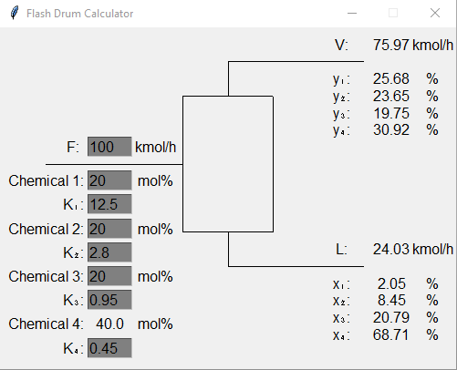

# FlashDistillation

Simple Python based GUI calculator on a flash drum. Uses the Newton-Raphson algorithm to solve the Rachford-Rice equation. Supports up to 4 chemical species. Mouse click anywhere to update model.

graphics.py module provided by John Zelle
